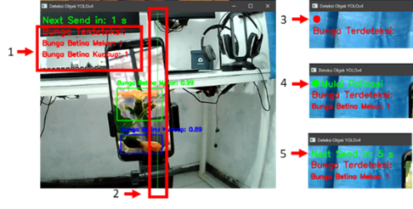

#### Silahkan kunjungi link berikut untuk memperoleh informasi lebih lengkap terkait tugas akhir saya.

### Buku Tugas akhir

https://repositori.telkomuniversity.ac.id/home/catalog/id/208372/slug/sistem-polinasi-melon-pada-greenhouse-menggunakan-yolov4.html

### Jurnal

https://repositori.telkomuniversity.ac.id/pustaka/files/208372/article_jurnal/sistem-polinasi-melon-pada-greenhouse-menggunakan-yolov4.pdf

 
 
 
 

<h1 align="center">MELON-POLLINATION-SYSTEM-IN-GREENHOUSE-USING-YOLOv4</h1>

## Latar Belakang

Greenhouse merupakan sarana untuk mengembangkan pertanian tanpa mengenal
musim, akan tetapi kondisi greenhouse yang tertutup menyebabkan serangga dan angin
tidak dapat membantu proses penyerbukan. Kondisi ini menyebabkan produktifitas
tanaman buah (melon) menjadi rendah, sehingga perlu dibantu dengan polinasi manual
oleh manusia, masalahnya adalah keberadaan manusia sebagai sumber daya yang
mahal, sehingga diperlukan suatu alat untuk membantu polinasi. Oleh karena itu, dibuatlah alat yang dapat membantu melakukan polinasi.
 

Dalam Pelaksanaannya akan dirancang sebuah blower yang dilengkapi dengan microcontroller arduino dengan pemicunya berupa hasil dari deteksi objek. Hasil tangkapan di terima oleh laptop untuk selanjutnya dilakukan pemrosesan data berupa klasifikasi untuk identifikasi jenis bunga tersebut tergolong bunga jantan, bunga betina, atau bunga betina yang sudah mekar, proses deteksi ini menggunakan metode algoritma You Only Look Once (YOLOv4). Setelah terdeteksi adanya bunga betina yang sudah mekar. dilanjutkan dengan mengirimkan perintah ke mikrokontroler arduino untuk menyalakan Blower yang terdapat serbuk sari diatasnya untuk mulai melakukan proses penyebaran serbuk sari. Hasil menunjukkan alat yang digunakan mampu digunakan untuk melakukan polinasi dan dapat melakukan pendeteksian jenis bunga menggunakan YOLOv4 dengan nilai F1-score 0.97, Average IoU 88.73% , mAP 97.84% pada konfigurasi training dengan split dataset 90:10 dan
learning rate 0.001, memperoleh hasil pada uji keseluruhan yaitu 92.8%. Dengan cara ini, polinasi dapat dilakukan menggunakan Metode YOLOv4 sebagai deteksi objek dan alat bantu untuk melakukan polinasi. Oleh sebab itu dapat disimpulkan bahwa alat ini dapat digunakan untuk meningkatkan produktifitas tanaman melon, dan kemudahan pada polinasi.

## Rumusan Masalah

1. Bagaimana Membuat Model Untuk dapat mendetekis bunga melon dengan menggunakan data citra?

2. Bagaimana membuat alat untuk membantu polinasi buatan pada tanaman melon dilingkungan greenhouse?

## Tujuan
1. Membuat model klasifikasi dengan menggunakan metode Yolov4 dan data citra dari bunga melon jantan, bunga melon betina mekar, dan bunga melon betina kuncup.

2. Membuat perangkat yang dapat membantu dalam menyebarkan serbuk sari yang dapat di kontrol dengan microcontroller arduino UNO.

## Manfaat
1. Membantu dalam proses polinasi padabudidaya tanaman melon

2. Meningkatkan keberhasilan Polinasi melalui udara di dalamgreen house

3. Memudahkan dalam pelaksanaan polinasi

## Batasan Masalah
1. Tanaman melon yang diamanti hanya yang dewasa, berbunga dan masih segar. 

2. Penempatan webcam berada di lokasi bunga dapat terlihat jelas dan tidak tertutup daun. 

3. Sistem hanya dapat dipakai pada pagi hari ketika bunga melon mulai mekar.

4. Alat penyerbukan yang digunakan hanya dapat bergerak menoleh ke-kanan dan ke-kiri secara horizontal 180 derajat

## HASIL DAN PEMBAHASAN

## Perancangan Perangkat Keras
Berikut perangkat keras yang digunakan pada penelitian ini
<!--  -->

    

## Alat Penelitian
Berikut alat penelitan yang digunakan pada penelitian ini
<!--  -->
<!--  -->

    

    

## Data Yang Digunakan

Pada penelitian ini menggunakan dataset primer, diambil dari greenhouse yang berada pada Institut Teknologi Telkom Surabaya. Pengambilan gambar ini dipergunakan untuk melatih model untuk dapat mengetahui jenis bunga. Gambar ini nantinya akan dilabeli dan diolah pada pada proses training dan testing yang kemudian akan menghasilkan model yang dapat mendeteksi jenis bunga. 
<h3 align="center">Jenis Bunga Digunakan</h3>

| Jenis Bunga           | Jumlah |
|-----------------------|--------|
| Bunga Betina Kuncup   | 128    |
| Bunga Betina Mekar    | 98     |
| Bunga Jantan          | 85     |
| **Total**             | **311**|

## Membangun Dataset
Proses pelabelan dataset, pada penelitian ini menggunakan **roboflow** untuk melakukan pelabelan pada dataset. Roboflow merupakan platform yang terdapat pada web yang memiliki fitur untuk melakukan labeling pada dataset.  data yang dikumpulkan akan diolah untuk menjadi data yang memiliki label.

### Proses Annotate
Proses Annotate yaitu melakukan pembuatan kelas dan melakukan pembuatan bounding box. Ada tiga kelas yang dibuat, kelas Bunga Betina Kuncup, Bunga Betina Mekar, Bungan Jantan. Kemudian membuat kotak menggunakan menu bounding box tool, arahkan pada bunga dan masukkan kedalam kelas sesuai jenis bunga. Setelah semua terlabeli sebelum masuk ke dataset, dilakukan split data, pada penelitian ini semua data gambar dijadikan data train agar data gambar tidak terpisah, karena untuk proses pembagian data train dan data test akan dilakukan pada tahap konfigurasi direktori file.

### Pelabelan Data
Pada tahap membangun dataset gambar akan ditampilkan beserta bounding box dan kelas, pada tahap ini dilakukan pengecekan ulang dari posisi bounding box dan jenis bunga apakah sesuai dengan kelas yang dipilih.
<!--  -->

    

### Proses Generate

Pada proses generate terdapat tahapan preprocessing dan augmentation, di bagian preprocessing terdapat pengaturan yang sudah disediakan oleh roboflow berupa Auto-orient dan Resize. Roboflow merekomendasikan untuk mengaktifkan fitur auto-orient karena saat sebuah gambar ditangkap, gambar tersebut berisikan metadata yang menentukan orientasi yang harus ditampilkan relatif terhadap piksel yang disusun pada disk. Resize berguna karena semakin kecil gambar yang digunakan maka akan membuat convolutions berjalan lebih cepat. Pada penelitian ini resize yang digunakan 416x416.

Pada augmentation menambahkan fitur flip dan grayscale. Penerapan fitur flip akan membuat versi gambar dalam bentuk orientasi berbeda, bisa vertikal maupun horizontal. Penggunaan fitur grayscale untuk membuat gambar menjadi keluaran abu-abu. Pada penelitian ini flip yang digunakan berorientasi vertikal dan menggunakan grayscale 100%.

Masuk ke tahap generate, pada roboflow tahap ini memiliki fitur yang dapat membuat 1 gambar menjadi beberapa variasi, Pada penelitian ini menggunakan fitur gratis sehingga 1 dataset maksimal memiliki 3 variasi, ketiga variasi tersebut dapat dilihat pada tabel diwabah, akan tetapi tidak semuanya terdapat 3 variasi, ada juga yang hanya terdapat 2 variasi, tergantung bagaimana roboflow membuat variasi tersebut. Hasil dari kedua variasi tersebut yang pertama membuat gambar original menjadi grayscale dan yang kedua membuat gambar original menjadi grayscale + flip. Sehingga kemungkinan gambar bunga itu akan lebih mudah dideteksi dalam kondisi apapun.

<!--  -->

    

Hal ini akan membuat dataset pada penelitian ini semakin banyak dan lebih variatif, Dengan begitu roboflow memberikan model dataset lebih banyak tanpa harus melewati proses pengumpulan dan pelabelan lebih banyak pada data latih, yang akan memakan banyak waktu. Dari roboflow tadi dengan menggunakan variasi grayscale dan flip mengakibatkan adanya perubahan pada dataset asli, menjadi dataset baru yang sudah ditambahkan variasi dari roboflow, sehingga totalnya berubah yang awalnya 311 menjadi 780.

### Total Dataset Bunga Dengan Variasi

Data yang digunakan memiliki 3 versi yaitu:

| Jenis Variasi       | Jumlah |
|---------------------|--------|
| Original            | 311    |
| Grayscale           | 235    |
| Grayscale + Flip    | 234    |
| **Total**           | **780**|

## Konfigurasi Direktori File
Pada tahap ini dilakukan penyocokan pada framework yolov4 darknet yang digunakan, dengan melakukan perubahan pada file terkait yolov4-custom.cfg, obj.data, obj.names, dan penempatan dataset yang sudah dilabeli. Pada penelitian ini menggunakan versi Yolov4 darknet, dikembangkan oleh AlexeyAB. Setelah semua sesuai lanjut untuk melakukan konfigurasi parameter model. Tahap ini juga melakukan split dataset, pada penelitian ini dataset akan dilakukan pembagian terdiri dari dua macam, yang pertama, dengan presntase 90:10 artinya 90% data training dan 10% sebagai data testing, kedua dengan presentase 80:20 artinya 80% merupakan data training dan 20% sebagai data testing.

## Konfigurasi Parameter Model

Pada tahap ini melakukan penyesuaian parameter model dengan pelatihan model yang akan dilakukan. Terdapat beberapa perubahan parameter dari yolov4 yang disesuaikan dengan penelitian ini, Perubahan yang dilakukan dapat dilihat pada tabel dibawah. Berikut 4 konfigurasi yang dilakukan untuk melakukan training data. 

| No | Parameter       | Training 1 | Training 2 | Training 3 | Training 4 |
|----|-----------------|------------|------------|------------|------------|
| 1  | Batch size      | 64         | 64         | 64         | 64         |
| 2  | Network size    | 416        | 416        | 416        | 416        |
| 3  | Subdivisions    | 64         | 64         | 64         | 64         |
| 4  | Max batch       | 6000       | 6000       | 6000       | 6000       |
| 5  | Filters         | 24         | 24         | 24         | 24         |
| 6  | Class           | 3          | 3          | 3          | 3          |
| 7  | Learning Rate   | 0.001      | 0.00261    | 0.001      | 0.00261    |
| 8  | Split dataset   | 90 : 10    | 90 : 10    | 80 : 20    | 80 : 20    |

## Hasil Pelatihan Data

Hasil pelatihan data ini merupakan proses training dataset dilakukan untuk membuat model yang dapat digunakan untuk melakukan deteksi dan mengenali benda yang sudah dilabeli sebelumnya. Pada penelitian ini terdapat skenario training dataset dengan melakukan split dataset dan learning rate yang menghasilkan output nilai rata- rata berupa Precision, recall, F1 score, average IoU, dan mAP.

<h3 align="center">Hasil Pelatihan</h3>

| Training      | 1      | 2      | 3      | 4      |
|---------------|--------|--------|--------|--------|
| **TP**        | 90     | 90     | 185    | 181    |
| **FP**        | 2      | 3      | 13     | 12     |
| **FN**        | 3      | 3      | 11     | 15     |
| **Precision** | 0.98   | 0.97   | 0.93   | 0.94   |
| **Recall**    | 0.97   | 0.97   | 0.94   | 0.92   |
| **F1 Score**  | 0.97   | 0.97   | 0.94   | 0.93   |
| **Average IoU** | 88.73% | 88.25% | 83.70% | 84.88% |
| **mAP**       | 97.84% | 96.76% | 95.20% | 94.49% |

Jadi model training 1 yang akan digunakan pada penelitian ini, karena memiliki nilai keseluruhan terbaik daripada training dataset yang lain. Dengan menggunakan split data 90:10 dan nilai learning rate 0.001 akan menghasilkan nilai testing dataset dengan akurasi yang lebih baik. 

## Pengujian Sistem

Pada pengujian sistem ini, dilakukan untuk mengetahui apakah sistem berjalan dengan baik. Terdapat 3 pengujian yang dilakukan. Pertama pengujian dilakukan pada rangkaian perangkat keras guna mengetahui apakah perangkat keras dapat berjalan sesuai dengan kondisi yang sudah ditentukan. Kedua pada pendeteksian objek, pengujian ini dilakukan untuk mengetahui apakah model yang dibuat sudah dapat mendeteksi objek. Ketiga pengujian pada uji keseluruhan, pada uji keseluruhan ini sistem diuji dari awal menyala, dapat mendeteksi adanya objek, menyemprotkan serbuk sari tepat pada objek, hingga sistem berhenti.

## Pengujian Rangkaian Perangkat Keras

Pada pengujian rangkaian perangkat keras, merupakan tahapan yang dilakukan untuk memastikan bahwa sistem yang digunakan sesuai dengan skenario rancangan sistem yang sudah ada. Yaitu dengan menguji alat yang sudah dibuat apakah alat tersebut sudah dapat bekerja sesuai skenario yang di buat dan mendapatkan hasil sesuai dengan yang diharapkan. Berikut skenario dan hasil dari pengujian yang sudah dibuat.

<h3 align="center">Hasil Pengujian</h3>

| **Komponen**            | **Skenario Uji**                          | **Hasil yang Diharapkan**                                 | **Hasil Pengujian** |
|--------------------------|-------------------------------------------|----------------------------------------------------------|---------------------|
| **Arduino**             | Menyala                                  | Menyala pada pukul 06.00 hingga 07.00                   | Sesuai             |
|                          | Mati                                     | Mati di luar jam aktif                                   | Sesuai             |
|                          | Menerima data                            | Dapat menerima data                                      | Sesuai             |
|                          | Control servo                            | Menghentikan servo selama 5 detik                       | Sesuai             |
|                          | Control relay                            | Menyalakan relay selama 5 detik                         | Sesuai             |
| **Servo**               | Gerak servo                              | Servo bergerak dari 0 ke 180 derajat dan sebaliknya      | Sesuai             |
|                          |                                          | Servo bergerak dengan delay 0.35 detik setiap 1 derajat | Sesuai             |
| **Relay**               | On                                       | Mengaktifkan blower                                      | Sesuai             |
|                          | Off                                      | Blower berhenti beroperasi                               | Sesuai             |
| **Blower**              | On                                       | Meniupkan serbuk sari                                    | Sesuai             |
|                          | Off                                      | Blower berhenti                                          | Sesuai             |
| **Penampung Serbuk Sari**| Terkena dorongan angin                   | Serbuk sari berhasil keluar                              | Sesuai             |
|                          | Tidak terdorong angin                    | Serbuk sari tetap berada di tempat                      | Sesuai             |

## Pengujian Deteksi Objek

Pada pengujian deteksi objek, sebelum dilakukannya pengujian deteksi objek, dilakukan terlebih dahulu pengujian deteksi dengan menggunakan jarak tertentu. Pengujian ini dilakukan untuk mengetahui kemampuan model dalam mendeteksi objek pada jarak tertentu. Pengujian dilakukan dengan 5 skenario jarak berikut hasil dari pengujian jarak tersebut.

| **Jarak** | **Jumlah** | **Terdeteksi** | **Tidak Terdeteksi** |
|-----------|------------|----------------|-----------------------|
| 20 cm     | 15         | 15             | 0                     |
| 25 cm     | 15         | 15             | 0                     |
| 30 cm     | 15         | 15             | 0                     |
| 35 cm     | 15         | 8              | 7                     |
| 40 cm     | 15         | 4              | 11                    |

Dari pengujian jarak diketahui bahwa pada jarak 20cm, 25cm, dan 30cm objek masih dapat terdeteksi, akan tetapi pada jarak 35cm dan 40cm objek mulai tidak dapat terdeteksi hal ini dapat terjadi karena objek yang terlalu jauh. Dengan begitu pada penelitian ini pengujian menggunakan jarak maksimum yang dapat dicapai yaitu 30cm.

    

Selanjutnya pada pengujian deteksi objek dilakukan dengan menggunakan gambar pada hp yang diarahkan ke webcam, pengujian ini dilakukan untuk mengetahui apakah model yang digunakan dapat mendeteksi dengan benar dan akurat.

| **Jenis Bunga**   | **Jumlah** | **Terdeteksi Benar** | **Terdeteksi Salah** | **Tidak Terdeteksi** |
|--------------------|------------|----------------|-----------------------|-----------|
| Betina Kuncup     | 15         | 13             | 1                     | 1         |
| Betina Mekar      | 15         | 14             | 1                     | 0         |
| Jantan            | 15         | 15             | 0                     | 0         |
| **Total**         | **45**     | **42**         | **2**                 | **1**     | 

Dari hasil pengujian deteksi objek dengan menggunakan tiga jenis bunga dari tiap jenisnya berjumlah 15 gambar, dengan total pengujian pada 45 kali percobaan didapatkan hasil  42 benar, 1 salah, dan 1 tidak terdeteksi. Jika dirata-rata keseluruhan, maka presentase keberhasilan mencapai 93% dalam melakukan deteksi objek.

## Uji Keseluruhan

Pada uji keseluruhan ini, sistem yang telah dibangun telah diuji untuk melaksanakan proses polinasi guna mengevaluasi keberhasilan perangkat keras dan deteksi objek yang digunakan. Ujicoba ini bertujuan untuk menguji kinerja dan keandalan sistem, serta untuk memverifikasi apakah perangkat keras dan fungsi deteksi objek benar-benar dapat berfungsi sebagaimana yang diharapkan, berikut penjelasan dari komponen yang ditampilkan pada video hasil uji keseluruhan.

    

### Keterangan

1. Bunga yang sedang dideteksi.
2. Tampak keseluruhan.
3. Jumlah yang Terdeteksi, Tidak Terdeteksi, dan Terdeteksi Salah.
4. Tampilan dari proses pendeteksian objek.
5. Komponen hardware yang digunakan.

Pengujian ini dilakukan dengan menggunakan sejumlah gambar yang terdiri dari tiga macam yaitu Bunga Betina Kuncup, Bunga Betina Mekar, dan bunga jantan. Gambar-gambar ini ditempatkan secara acak untuk memberikan variasi kondisi yang berbeda dalam pengujian.

<!--  -->

    

1. Indikator Bunga dan Jumlah Bunga Yang Terdeteksi.
2. Garis Tengah Pada Frame.
3. Indikator Deteksi Bunga.
4. Indikator Mengirim Data Ke Arduino.
5. Indikator Delay.
 

<h3 align="center">Hasil dari uji keseluruhan</h3>

<!--  -->

    

Dari hasil pengujian tersebut dapat disimpulkan bahwa alat dapat bekerja dengan cukup baik. Dari 14 bunga yang dideteksi terdapat 13 yang hasil pendeteksian sesuai dengan jenis bunga dan dinyatakan benar, dan 1 hasil pendeteksian yang tidak sesuai dengan jenis bunga dan dinyatakan salah, sehingga jika dirata-rata angka keberhasilan dalam melakukan deteksi mencapai 92.8%. Dari 14 jumlah bunga yang dideteksi terdapat 6 bunga melon betina mekar yang harus dilakukan polinasi oleh perangkat keras.

Keberhasilan dalam melakukan polinasi cukup baik yaitu dari 6 bunga, terdapat 5 yang berhasil di polinasi dan 1 tidak ter polinasi. Pada pengujian ini kegagalan dalam melakukan polinasi terjadi akibat kesalahan saat melakukan proses pendeteksian dari bunga betina mekar yang terdeteksi menjadi bunga jantan, hal itu mengakibatkan perangkat keras melewati bunga tersebut sehingga tidak dilakukan polinasi pada bunga betina mekar tersebut. Sehingga dengan hasil tersebut perangkat keras juga berhasil bekerja cukup baik dari awal hingga akhir dalam melakukan proses penyerbukan. 

 
Pelaksanaan pengujian dapat dilihat pada link berikut: 
 
 

    <a href="https://youtu.be/h_PwIwbu6fA" target="_blank">
        <button style="background-color: #4CAF50; color: white; padding: 10px 20px; border-radius: 5px; font-size: 16px;">Pengujian Keseluruhan Sistem</button>
    </a>

## Pembahasan
Berdasarkan sistem deteksi bunga melon yang sudah dibuat, didapatkan hasil perangkat keras yang dapat melakukan polinasi dan algoritma deteksi objek you only look once (YOLO) dapat diimplementasikan untuk melakukan deteksi pada jenis bunga melon dengan label Bunga Betina Kuncup, Bunga Betina Mekar, dan Bunga Jantan dengan nilai rata-rata terbesar pada training 1 memperoleh F1-score 0.97 , IoU 88.73% , dan mAP 97.84%.
 

Penerapan YOLO memang sangat membatu dalam melakukan deteksi objek, YOLO sendiri sudah dikembangkan sejak tahun 2015 dimulai dari Yolov1 hingga sekarang saat penelitian ini dibuat sudah berkembang hingga Yolov8, penelitian ini menggunakan Yolov4 yang mulai ada sejak tahun 2020, sehingga untuk penelitian selanjutnya dapat mempertimbangkan penggunaan YOLO versi yang lebih baru.
 

Penggunaan perangkat keras yang memadai menjadi hal yang perlu diperhatikan dalam penerapan penggunaan YOLO. Hal ini untuk meningkatkan keberhasilan dalam pendeteksian objek. Ada beberapa hal yang menyebabkan proses penyerbukan ini tidak maksimal dan juga mengalami kendala. Laptop yang digunakan tidak cukup memadai untuk mengimplementasikan penggunaan Yolov4, hal ini ditandai dengan pemrosesan gambar yang lambat, dan karena lambatnya pemrosesan gambar ini yang menyebabkan servo harus bergerak dengan lambat juga, yaitu dengan delay 0.35 detik setiap 1 derajatnya, untuk meminimalkan blur pada saat alat bergerak ke kanan dan kiri. Karena penggunaan servo yang diharuskan bergerak lambat ini juga menyebabkan pergerakan servo terlihat tidak halus, bisa juga terjadi karena gear servo yang sudah aus karena penggunaan yang berulang dengan beban yang cukup berat.
 

Pada proses pengumpulan dan pelabelan pada dataset juga menjadi penentu tingkat keberhasilan deteksi bunga dengan menggunakan YOLO. Dengan semakin banyak dataset yang digunakan untuk merancang deteksi bunga, maka akan semakin akurat juga hasil dari deteksi yang diperoleh. Hal ini dikarenakan dengan semakin banyaknya dataset yang digunakan, maka sistem akan semakin banyak ragam dari bentuk dan posisi gambar saat melakukan pengujian (testing), yang akan menghasilkan hasil deteksi dengan akurasi yang lebih baik.
 

Sedikitnya dataset yang menyebabkan nilai akurasi pada penelitian ini tidak terlalu baik dan mengalami kesalahan dalam melakukan deteksi. Dataset yang dipergunakan saat proses pelatihan menggunakan gambar primer, yaitu gambar yang diambil hanya pada greenhouse institut teknologi telkom surabaya, tidak menggunakan data yang lebih beragam seperti pada area dan tempat lain, hal ini yang menyebabkan sistem perlu lebih dalam mengenali ragam bentuk bunga. Pada penelitian ini hanya menggunakan 311 dataset gambar bunga melon betina kuncup, bunga melon betina mekar, dan bunga melon jantan, yang kemudian ditambahkan variasi baru oleh roboflow dan total dataset berjumlah 780. Sedikitnya dataset yang dipergunakan ini dikarenakan tidak banyak dataset bunga melon yang terdapat pada data open source.
 

Selain itu juga adanya human error pada saat melakukan proses labelling yang dilakukan secara manual ini menyebabkan turunnya pada tingkat akurasi. Human error yang terjadi bisa saat dilakukannya pembuatan bounding box pada setiap gambar, penempatan bounding box yang tidak pas seperti terlalu melebar jauh dari posisi bunga sehingga membuat gambar tidak terlabeli dengan baik. Ada juga human error yang terdapat pada alat polinasi seperti pembuatan mounting perlu ditingkatkan lagi dalam hal presisi, yang pada titik tertentu membuat beban servo meningkat karena harus mendorong bagian yang terlalu rapat karena pemasangan yang miring, apalagi terdapat selang yang cukup mengganggu pergerakan servo karena posisi selang yang menggantung.
 

Dengan adanya sistem polinasi ini harapannya dapat diimplementasikan ke dalam skala yang lebih besar yang berupa melakukan polinasi pada seluruh tanaman yang ada pada greenhouse. Maka dengan adanya polinasi yang dapat mencakup seluruh area greenhouse akan membantu dalam proses penyerbukan buatan yang lebih baik. Pada penelitian ini masih perlu dikembangkan lagi dalam melakukan proses deteksi maupun pada perangkat keras yang digunakan untuk polinasi, seperti yang dijelaskan pada paragraf sebelumnya dan juga sistem ini belum dapat melakukan penyerbukan secara menyeluruh pada seluruh tanaman yang ada pada greenhouse.

## Kesimpulan
Berdasarkan hasil pembahasan dan hasil pengolahan data yang ada pada penelitian ini, dapat ditunjukkan pada proses polinasi melon yang berhasil diimplementasikan. Dari model yang dibuat dapat melakukan deteksi pada jenis bunga betina kuncup, bunga betina mekar, dan bunga jantan dengan menggunakan YOLOv4 dapat dilakukan. Selain itu juga pada empat skenario training data yang dilakukan didapatkan nilai training terbaik pada training 1 menggunakan split dataset 90:10 dan learning rate 0.001 dengan hasil Precision 0.98, Recall 0.97, dan F1 score 0.97. mememperoleh nilai Average IoU 88.73%, dan nilai mAP 97.84%.
Juga dapat dibuatnya perangkat yang dapat membantu proses penyerbukan yang di kontrol oleh arduino UNO, selain itu penggunaan perangkat keras juga berjalan lancar mulai dari awal hingga akhir berjalannya sistem dalam melakukan penyerbukan. Sehingga alat yang dibuat dapat untuk meningkatkan produktifitas tanaman melon , dari sumberdaya, tenaga kerja, dan kemudahan pada polinasi.

## Saran
Dari hasil yang didapat pada penelitian ini, saran yang dapat diberikan pada untuk penelitian selanjutnya adalah:
1.	Penambahan pada jumlah dataset dengan gambar yang lebih bervariasi dari pola gambar yang digunakan agar didapatkan model yang dapat mengenali jenis objek lebih baik dan lebih akurat.
2.	Membuat perangkat keras yang lebih akurat dan presisi untuk meningkatkan tingkat keberhasilan dan berjalan lancarnya proses yang dilakukan pada saat perangkat keras beroperasi.
3.	Melakukan proses deteksi dengan menggunakan device dengan spesifikasi GPU yang lebih baik, guna mempercepat proses training data dan meningkatkan kecepatan dalam deteksi objek.
4.	Membuat konfigurasi parameter model yang lebih baik, untuk mendapatkan hasil deteksi yang lebih akurat dan meminimalkan kesalah dalam deteksi.
5.	Pengembangan alat agar dapat bergerak lebih fleksibel dengan dapat bergerak vertikal dan horizontal, serta bergerak maju dan mundur.
