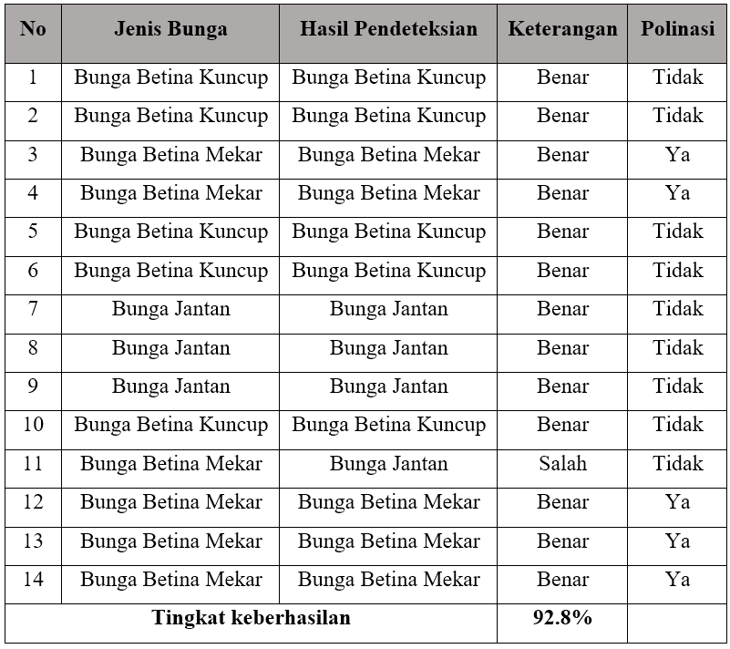

<h1 align="center">MELON-POLLINATION-SYSTEM-IN-GREENHOUSE-USING-YOLOv4</h1>

## Latar Belakang

Greenhouse merupakan sarana untuk mengembangkan pertanian tanpa mengenal
musim, akan tetapi kondisi greenhouse yang tertutup menyebabkan serangga dan angin
tidak dapat membantu proses penyerbukan. Kondisi ini menyebabkan produktifitas
tanaman buah (melon) menjadi rendah, sehingga perlu dibantu dengan polinasi manual
oleh manusia, masalahnya adalah keberadaan manusia sebagai sumber daya yang
mahal, sehingga diperlukan suatu alat untuk membantu polinasi. Oleh karena itu, dibuatlah alat yang dapat membantu melakukan polinasi.
 

Dalam Pelaksanaannya akan dirancang sebuah blower yang dilengkapi dengan microcontroller arduino dengan pemicunya berupa hasil dari deteksi objek. Hasil tangkapan di terima oleh laptop untuk selanjutnya dilakukan pemrosesan data berupa klasifikasi untuk identifikasi jenis bunga tersebut tergolong bunga jantan, bunga betina, atau bunga betina yang sudah mekar, proses deteksi ini menggunakan metode algoritma You Only Look Once (YOLOv4). Setelah terdeteksi adanya bunga betina yang sudah mekar. dilanjutkan dengan mengirimkan perintah ke mikrokontroler arduino untuk menyalakan Blower yang terdapat serbuk sari diatasnya untuk mulai melakukan proses penyebaran serbuk sari. Hasil menunjukkan alat yang digunakan mampu digunakan untuk melakukan polinasi dan dapat melakukan pendeteksian jenis bunga menggunakan YOLOv4 dengan nilai F1-score 0.97, Average IoU 88.73% , mAP 97.84% pada konfigurasi training dengan split dataset 90:10 dan
learning rate 0.001, memperoleh hasil pada uji keseluruhan yaitu 92.8%. Dengan cara ini, polinasi dapat dilakukan menggunakan Metode YOLOv4 sebagai deteksi objek dan alat bantu untuk melakukan polinasi. Oleh sebab itu dapat disimpulkan bahwa alat ini dapat digunakan untuk meningkatkan produktifitas tanaman melon, dan kemudahan pada polinasi.

## Rumusan Masalah

1. Bagaimana Membuat Model Untuk dapat mendetekis bunga melon dengan menggunakan data citra?

2. Bagaimana membuat alat untuk membantu polinasi buatan pada tanaman melon dilingkungan greenhouse?

## Tujuan
1. Membuat model klasifikasi dengan menggunakan metode Yolov4 dan data citra dari bunga melon jantan, bunga melon betina mekar, dan bunga melon betina kuncup.

2. Membuat perangkat yang dapat membantu dalam menyebarkan serbuk sari yang dapat di kontrol dengan microcontroller arduino UNO.

## Manfaat
1. Membantu dalam proses polinasi padabudidaya tanaman melon

2. Meningkatkan keberhasilan Polinasi melalui udara di dalamgreen house

3. Memudahkan dalam pelaksanaan polinasi

## Batasan Masalah
1. Tanaman melon yang diamanti hanya yang dewasa, berbunga dan masih segar. 

2. Penempatan webcam berada di lokasi bunga dapat terlihat jelas dan tidak tertutup daun. 

3. Sistem hanya dapat dipakai pada pagi hari ketika bunga melon mulai mekar.

4. Alat penyerbukan yang digunakan hanya dapat bergerak menoleh ke-kanan dan ke-kiri secara horizontal 180 derajat

## HASIL DAN PEMBAHASAN

## Perancangan Perangkat Keras
Berikut perangkat keras yang digunakan pada penelitian ini
<!--  -->

    

## Alat Penelitian
Berikut alat penelitan yang digunakan pada penelitian ini
<!--  -->
<!--  -->

    

    

## Pelabelan Data
Tahapan pelabelan data ini menggunakan ROBOFLOW
<!--  -->

    

## Data Yang Digunakan

Data yang digunakan memiliki 3 versi yaitu:
1. Original
2. Grayscale
3. Grayscale + Flip

<!--  -->

    

## Pengujian Klasifikasi Bunga

Pengujian klasifikasi bunga ini digunakan untuk mengetahui seberapa efektif sistem yang sudah dibuat

<!--  -->

    

 
Berikut hasil dari pengujian 
 
 
<!--  -->

    

 
Pelaksanaan pengujian dapat dilihat pada link berikut: 
 

    <a href="https://youtu.be/h_PwIwbu6fA" target="_blank">
        <button style="background-color: #4CAF50; color: white; padding: 10px 20px; border-radius: 5px; font-size: 16px;">Pengujian Keseluruhan Sistem</button>
    </a>

## Pembahasan
Berdasarkan sistem deteksi bunga melon yang sudah dibuat, didapatkan hasil perangkat keras yang dapat melakukan polinasi dan algoritma deteksi objek you only look once (YOLO) dapat diimplementasikan untuk melakukan deteksi pada jenis bunga melon dengan label Bunga Betina Kuncup, Bunga Betina Mekar, dan Bunga Jantan dengan nilai rata-rata terbesar pada training 1 memperoleh F1-score 0.97 , IoU 88.73% , dan mAP 97.84%.
 

Penerapan YOLO memang sangat membatu dalam melakukan deteksi objek, YOLO sendiri sudah dikembangkan sejak tahun 2015 dimulai dari Yolov1 hingga sekarang saat penelitian ini dibuat sudah berkembang hingga Yolov8, penelitian ini menggunakan Yolov4 yang mulai ada sejak tahun 2020, sehingga untuk penelitian selanjutnya dapat mempertimbangkan penggunaan YOLO versi yang lebih baru.
 

Penggunaan perangkat keras yang memadai menjadi hal yang perlu diperhatikan dalam penerapan penggunaan YOLO. Hal ini untuk meningkatkan keberhasilan dalam pendeteksian objek. Ada beberapa hal yang menyebabkan proses penyerbukan ini tidak maksimal dan juga mengalami kendala. Laptop yang digunakan tidak cukup memadai untuk mengimplementasikan penggunaan Yolov4, hal ini ditandai dengan pemrosesan gambar yang lambat, dan karena lambatnya pemrosesan gambar ini yang menyebabkan servo harus bergerak dengan lambat juga, yaitu dengan delay 0.35 detik setiap 1 derajatnya, untuk meminimalkan blur pada saat alat bergerak ke kanan dan kiri. Karena penggunaan servo yang diharuskan bergerak lambat ini juga menyebabkan pergerakan servo terlihat tidak halus, bisa juga terjadi karena gear servo yang sudah aus karena penggunaan yang berulang dengan beban yang cukup berat.
 

Pada proses pengumpulan dan pelabelan pada dataset juga menjadi penentu tingkat keberhasilan deteksi bunga dengan menggunakan YOLO. Dengan semakin banyak dataset yang digunakan untuk merancang deteksi bunga, maka akan semakin akurat juga hasil dari deteksi yang diperoleh. Hal ini dikarenakan dengan semakin banyaknya dataset yang digunakan, maka sistem akan semakin banyak ragam dari bentuk dan posisi gambar saat melakukan pengujian (testing), yang akan menghasilkan hasil deteksi dengan akurasi yang lebih baik.
 

Sedikitnya dataset yang menyebabkan nilai akurasi pada penelitian ini tidak terlalu baik dan mengalami kesalahan dalam melakukan deteksi. Dataset yang dipergunakan saat proses pelatihan menggunakan gambar primer, yaitu gambar yang diambil hanya pada greenhouse institut teknologi telkom surabaya, tidak menggunakan data yang lebih beragam seperti pada area dan tempat lain, hal ini yang menyebabkan sistem perlu lebih dalam mengenali ragam bentuk bunga. Pada penelitian ini hanya menggunakan 311 dataset gambar bunga melon betina kuncup, bunga melon betina mekar, dan bunga melon jantan, yang kemudian ditambahkan variasi baru oleh roboflow dan total dataset berjumlah 780. Sedikitnya dataset yang dipergunakan ini dikarenakan tidak banyak dataset bunga melon yang terdapat pada data open source.
 

Selain itu juga adanya human error pada saat melakukan proses labelling yang dilakukan secara manual ini menyebabkan turunnya pada tingkat akurasi. Human error yang terjadi bisa saat dilakukannya pembuatan bounding box pada setiap gambar, penempatan bounding box yang tidak pas seperti terlalu melebar jauh dari posisi bunga sehingga membuat gambar tidak terlabeli dengan baik. Ada juga human error yang terdapat pada alat polinasi seperti pembuatan mounting perlu ditingkatkan lagi dalam hal presisi, yang pada titik tertentu membuat beban servo meningkat karena harus mendorong bagian yang terlalu rapat karena pemasangan yang miring, apalagi terdapat selang yang cukup mengganggu pergerakan servo karena posisi selang yang menggantung.
 

Dengan adanya sistem polinasi ini harapannya dapat diimplementasikan ke dalam skala yang lebih besar yang berupa melakukan polinasi pada seluruh tanaman yang ada pada greenhouse. Maka dengan adanya polinasi yang dapat mencakup seluruh area greenhouse akan membantu dalam proses penyerbukan buatan yang lebih baik. Pada penelitian ini masih perlu dikembangkan lagi dalam melakukan proses deteksi maupun pada perangkat keras yang digunakan untuk polinasi, seperti yang dijelaskan pada paragraf sebelumnya dan juga sistem ini belum dapat melakukan penyerbukan secara menyeluruh pada seluruh tanaman yang ada pada greenhouse.

## Kesimpulan
Berdasarkan hasil pembahasan dan hasil pengolahan data yang ada pada penelitian ini, dapat ditunjukkan pada proses polinasi melon yang berhasil diimplementasikan. Dari model yang dibuat dapat melakukan deteksi pada jenis bunga betina kuncup, bunga betina mekar, dan bunga jantan dengan menggunakan YOLOv4 dapat dilakukan. Selain itu juga pada empat skenario training data yang dilakukan didapatkan nilai training terbaik pada training 1 menggunakan split dataset 90:10 dan learning rate 0.001 dengan hasil Precision 0.98, Recall 0.97, dan F1 score 0.97. mememperoleh nilai Average IoU 88.73%, dan nilai mAP 97.84%.
Juga dapat dibuatnya perangkat yang dapat membantu proses penyerbukan yang di kontrol oleh arduino UNO, selain itu penggunaan perangkat keras juga berjalan lancar mulai dari awal hingga akhir berjalannya sistem dalam melakukan penyerbukan. Sehingga alat yang dibuat dapat untuk meningkatkan produktifitas tanaman melon , dari sumberdaya, tenaga kerja, dan kemudahan pada polinasi.

## Saran
Dari hasil yang didapat pada penelitian ini, saran yang dapat diberikan pada untuk penelitian selanjutnya adalah:
1.	Penambahan pada jumlah dataset dengan gambar yang lebih bervariasi dari pola gambar yang digunakan agar didapatkan model yang dapat mengenali jenis objek lebih baik dan lebih akurat.
2.	Membuat perangkat keras yang lebih akurat dan presisi untuk meningkatkan tingkat keberhasilan dan berjalan lancarnya proses yang dilakukan pada saat perangkat keras beroperasi.
3.	Melakukan proses deteksi dengan menggunakan device dengan spesifikasi GPU yang lebih baik, guna mempercepat proses training data dan meningkatkan kecepatan dalam deteksi objek.
4.	Membuat konfigurasi parameter model yang lebih baik, untuk mendapatkan hasil deteksi yang lebih akurat dan meminimalkan kesalah dalam deteksi.
5.	Pengembangan alat agar dapat bergerak lebih fleksibel dengan dapat bergerak vertikal dan horizontal, serta bergerak maju dan mundur.
